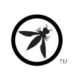

# Quem é a OWASP?

O **Open Web Application Security Project ® (OWASP)** é uma fundação sem fins lucrativos que trabalha para melhorar a segurança do software. Por meio de projetos de software de código aberto liderados pela comunidade, centenas de capítulos locais em todo o mundo, dezenas de milhares de membros e importantes conferências educacionais e de treinamento, a OWASP Foundation é a fonte para desenvolvedores e tecnólogos protegerem a web.

## Por que se associar?

Para responder a essa pergunta podemos ter os mais variados motivos. Primeiramente, é uma forma de colaborar financeiramente com a Fundação para que possam continuar desenvolvendo atividades que agregam enormemente na missão de proteção da web.

Eu particularmente decidi me associar por achar que pode ser um alavancador para a carreira na área de segurança e desenvolvimento. Ao se tornar membro você tem a possibilidade de aumentar sua rede de contatos, ter descontos em treinamentos e eventos, oportunidades de voluntariado, contribuição em projetos, etc.

Após me associar, tive acesso a benefícios que, particularmente, achei muito interessantes. Passei a ter gratuitamente conta de dois ambientes de treinamentos online chamados **[SecureFlag](https://www.secureflag.com/)** e **[Security Journey](https://www.securityjourney.com/)** e  uma conta na **[Ubiq](https://www.ubiqsecurity.com/)**.

**SecureFlag**

Os desenvolvedores localizam, exploram e corrigem manualmente o código de aplicativos vulneráveis ​​executados em ambientes de desenvolvimento acessados ​​por meio de um navegador da web. A plataforma oferece treinamento 100% prático, sem perguntas de múltipla escolha, e usa um mecanismo capaz de testar ao vivo as alterações do código para medir a eficácia, exibindo instantaneamente se o código foi corrigido e concedendo pontos após a conclusão do exercício.

**Security Journey**

Por meio de desafios e competições, o Security Journey ajuda você a progredir em uma **missão orientada por mapas** para obter **cinturões e conquistas de nível superior** . Os alunos podem ver seu progresso em sua jornada à medida que aumentam seus conhecimentos de segurança.

**Ubiq Security**

Criptografe seus dados mais confidenciais antes que eles saiam do aplicativo, para que a camada de armazenamento – e os adversários – vejam apenas o texto cifrado. A criptografia nativa do lado do cliente do aplicativo protege os dados contra invasores sofisticados, ataques à cadeia de suprimentos e ameaças internas.
